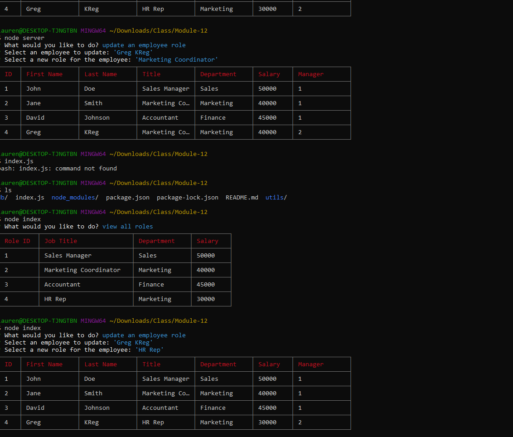

# Employee Tracker - Module 12

## Description
I made this using node, mysql, mysql2, inquirer, dotenv, and cli-table. 


## Installation

Download the repo. Start a mysql server. Open bash in the root folder

```sh
npm i 
node ./utils/seeds
node index
```


[Video Demo](https://drive.google.com/file/d/1sQ6Xl5Ebk6A1xjsSlbHcLNldt9FRcv80/view)
